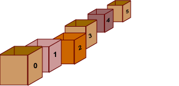

# Fast Track Weekend


**Day 1 Tasks:**
- [ ] Welcome and What to expect
- [ ] Housekeeping
    - Mute yourself, camera on
    - Personal Empowerment Plan 
        - read, google, peer, then instructors
    - Feel free to speak up/ask questions in the zoom chat or in the slack channel
- [ ] intros
    - [ ] name, pronouns
    - [ ] our pathways to Flatiron
    - [ ] hobby or favorite food
- [ ] Start learning 😃

Welcome to our June edition of Fast Track!!! First of all, we hope that you find yourselves safe and healthy during these difficult times. We are so grateful and excited that you have decided to join us this weekend to learn about our community and to embark on your tech journey! We hope you have a great experience and that you learn a lot.

Today will consist of 4 rotations that each include a small lecture followed by a set amount of time to work on some labs with your peers. We'll break for half hour after the 2nd rotation in order to get some brain food! 

The second day will begin with a quick review of Day 1. Then, it will consist of 2 rotations in the morning followed by lunch and then time in the afternoon for working on labs.

**Day 1 Topics:**

We will be getting into Ruby and handling error messages that come up as we program. Then we'll transition into learning about data types and variables in Ruby. From there, we'll go more into depth into a super popular data structure called an array. Then to wrap up the day, we're going to get into logic and conditionals in programming.

**Day 2 Topics:**

We will be reviewing Day 1 topics. Then we will proceed to cover looping and iterating in Ruby. 💯


______

## Intro to Ruby & Error Messages

Ruby programs are basically composed of 3 things:

- Ruby's keywords
    - ex. `if`, `else`, `end`, `puts`
- Literal pieces of data
    - strings, numbers, booleans (`true` or `false`)...
- Barewords. Words we make up and set equal to things (variables)

If we don't use a language's keyword, literal piece of data, or bareword, then we're going to get an error! 


And let me tell you, error messages are AWESOME! That may sound crazy, but they truly are because without errors messages, then it will be difficult to know that something in our program is wrong! Error messages will often give new programmers anxiety or may make them feel like they're not smart enough to be a programmer (**imposter syndrome!**). However, I encourage you to get comfortable with them because error messages often give hints as to what we can fix and where. Seasoned programmers know more than anyone that as annoying as error messages may be, they are the useful guidance that we ought to be grateful for.


^^^ **Imposter syndrome!** Totally normal, you're not alone, and you ARE capable of anything!

###### Labs:
- Hello world
- Reading error messages


_____

## Variables, Types, and Methods

###### Students will be able to:
1. Assign names to values with variables
2. Create numbers
3. Use the basic number operators `+`, `-`, `*`, `/`
4. Distinguish strings from code
5. Use basic string methods, `+`, `.length`, `.downcase`, `.upcase`
6. Create arrays, add elements, and access them
7. Recognize `nil` values
8. Define methods with `def`
    - `def`, method body, `end`

##### What are variables?!
In Ruby, a variable is a name we give to a piece of data so that we can identify it later.

Here's an analogy - Think of a box. Inside that box, you put one single thing inside. On the outside of that box, you write what's inside of it. You can think of whatever is inside the box as the value and you can think of the label as the variable! 

##### String 
A string is a type of data in Ruby that can consist of letters, symbols, and numbers. The way we we denote a string is by wrapping it in single quotes or double quotes!
    
example: 
```ruby
my_string = "This is a string"
another_string = 'This is also a string' 
```


##### Integer
An integer is also another data type. It's a whole number!
example: 
```ruby
my_fave_number = 7
```

##### Float 
A float is also a numeric data type. They represent real numbers. In other words, a float is just a number that contains a decimal point.
example: 
```ruby
width = 7.8
```

##### Boolean
Booleans are data types that are used in logic statements to say if something is considered true or false. A boolean is either `true` or `false`.
example: 
```ruby
likes_cheese = true
has_cheese = false
```

____

##### Array
An array is a data structure meaning it is a structure that holds data! An array is a collection of data.

An analogy - You can think of an array as a row of boxes! Each box contains one single thing and on the outside of each box is a number to identify the box's position. In computer science, we start counting from 0 instead of 1. So the first box will be labeled `0`, the second box will be labeled `1`, etc. Assigning a variable name to an array would be like giving a name to identify the whole row of boxes.




###### Labs:
- Variables, types, and methods labs

_____

## Arrays & Array Methods


###### Students will be able to:
1. Create arrays
2. access values in arrays
3. add and delete from arrays

##### What's an array?? Review 
An array is like a list or a row boxes. Each box or list item holds a single value. They allow us to group similar information together.

Example:
```ruby
student1 = "Harry Potter"
student2 = "Ron Weasley"
student3 = "Hermione Granger"
student4 = "Draco Malfoy"

students = [student1, student2, student3, student4]
```

Tasks:
- [ ] access the *first* element from the array
- [ ] access the *last* element from the array
- [ ] add to the array 
    - [ ] to the *beginning* of the array
        - `unshift`
    - [ ] to the *end* of the array
        - `push`
        - `<<`
- [ ] delete from the array
    - [ ] from the *beginning* of the array
        - `pop`
    - [ ] from the *end* of the array
        - `shift`

BONUS:
- [ ] make a clone of an array
    - `clone`

###### Labs:
- Arrays Labs

____

## Logic & Conditionals

###### Students will be able to:
1. Recognize methods that will return boolean values
2. Use logical operators to manipulate true and false values
3. Recognize which ruby values are truthy and falsy
4. Use the double bang operator to determine truthiness in Ruby
5. Write an if / else statement


Boolean values can be either `true` or `false`. We use booleans in logic statements in order to determine if something or some statement is considered true or false. 

Ruby has an opinion! It thinks everything is "truthy" except for `false` and `nil`. It even sees strings and numbers as being "truthy" even though they aren't literally true or false. If you want to see whether a value is truthy or falsy, you can check it out by yourself in your program by putting a double bang in front of the value and printing it out! Like this:

```ruby
puts !!"Wondering if this string is truthy or not. Hmmm..."
```

##### Common Operators Used in Logic & Conditional Statements

- `==` (equals) checks if the left and right are equal
- `!=` (not equal) checks if the left and right are not equal
- `<` (less than) checks if the left is less than the right
- `>` (greater than) checks if the left is greater than the right
- `&&` (and) means 'both the left and the right must be true'
- `||` (or) means 'either the left or the right are true'
- `!` (not/bang) negates a boolean statement
- `!!` (double bang) turns a variable into a boolean type to determine its truthy or falsy value

Tasks:
- [ ] show methods that return boolean values
    -  `odd?`
    - `even?`
- [ ] if statements
    - `if`, `elsif`, `else`, `end`
- [ ] write method with if statement/s
- [ ] how do we check if two values are equal or not equal?
    - `==`
    - `!=`
- [ ] demonstrate `||` and `&&`

###### Labs:
- Conditionals Labs

____

🙌 DAY 1 🙌

